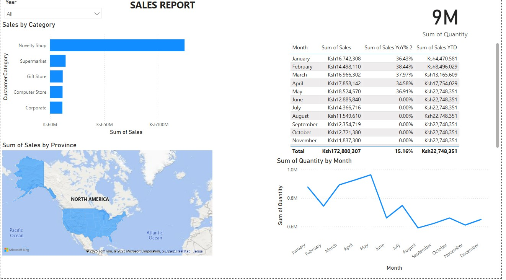

# 📊 Sales Performance Dashboard (Power BI)

## 🎯 Overview
This Power BI dashboard provides a **detailed analysis of sales performance**, including:
- Sales trends by month 📈
- Sales by category 📊
- Total sales and profit 💰
- Geographic sales distribution 🌍

## 📷 Screenshots

## 🔍 Key Features
- **Interactive Filters**: Users can filter by year and region.
- **Sales Trends**: Line chart showing monthly sales quantity.
- **Sales by Category**: Bar chart visualizing top-selling categories.
- **Map Visualization**: Sales breakdown by province.
- **YoY Growth**: Year-over-year sales percentage.

## 📁 Dataset
The dataset includes:
- `Date`
- `Order ID`
- `Product`
- `Category`
- `Region`
- `Sales`
- `Quantity`
- `Profit`

## 🚀 How to Use
1. Download the `.pbix` file from this repository.
2. Open it in **Power BI Desktop**.
3. Use the filters to explore sales trends.

## 📢 Contributing
If you have suggestions, feel free to fork this repo and submit a pull request!

## 📜 License
This project is open-source under the [MIT License](LICENSE).
